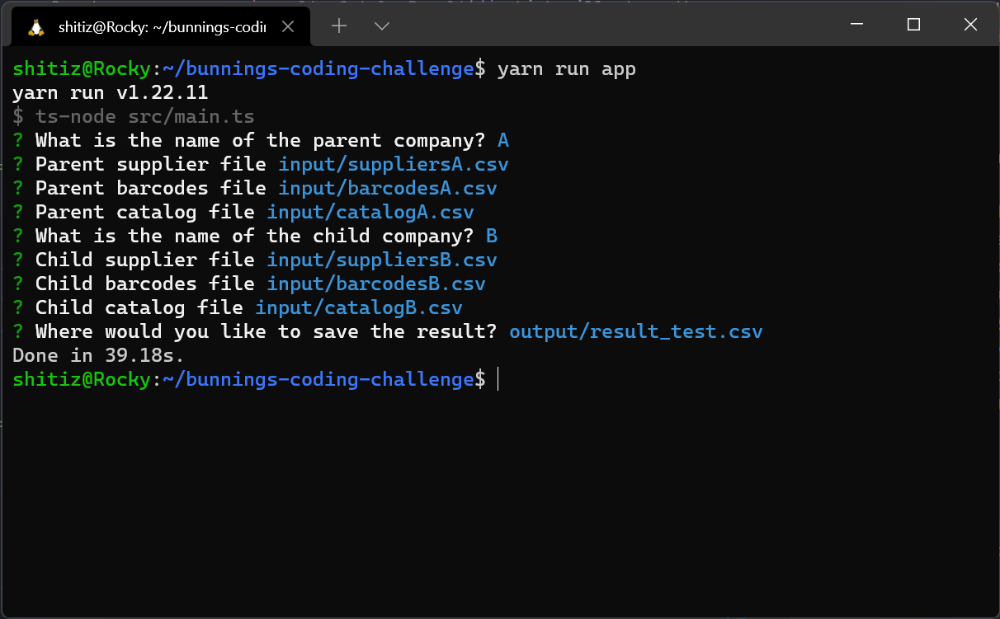

# Coding Skills Challenge

### Introduction

The project is built using Node and TypeScript. You will need NPM or Yarn to build and run the application. Unit
testing is done using Jest and can be seen in the *.test.ts files. A **sample output** from the program is stored in `output/result.csv`. 
It was tested with Node 16.8 but it should work with Node 14+. 

A basic flow of the program is:

- Ask the user for the names of parent and child companies, and their respective CSV files with data
- Load the data into models which are defined in `src/models/models.ts`. The methods to load the data
are defined in `src/utils/data.ts`.
- Once the data is loaded, merge the parent company and child company's catalogs by (`src/utils/merge-company-catalogs.ts`):
    - Create a new array, `result: CatalogResult[]` which will store the merged catalog
    - Add all the parent company's products into this array.
    - Add all the child company's products into this array, *except* the ones which have a barcode belonging to the 
    existing products. This ensures that duplicate products aren't added to the list. 
      
### Setup

```shell
git clone git@github.com:Dragooon/coding-challenge.git
cd coding-challenge
yarn
```

### Usage

Run the app by:

```shell
yarn run app
```
It will present a prompt and guide you through the process. 


